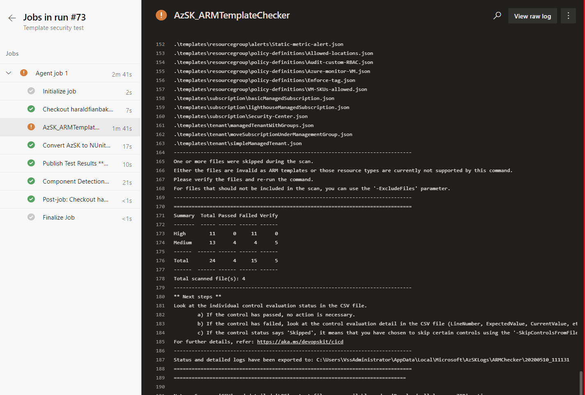

This repo will house an indevelopment solution for multi-tenant Azure landing zones. 

Upon completion of the development and engineering review, this solution will likely be featured in the Cloud Adoption Framework as an Azure landing zone implementation option.
In the meantime, please feel free to share feedback on the work-in-progress development or leverage the existing Azure Landing Zone implementation options: https://docs.microsoft.com/azure/cloud-adoption-framework/ready/landing-zone/implementation-options

# Narrative

Some companies have the need for multiple landing zones; support different lisencing models (EA, PAYG, CSP) and build, support and operate these landing zones across multiple tenants. This is especially important for partners where different delivery models account for a big deal of their business or enterprises that run seperated businesses within their enterprise and still require control and standardization.

This solution is not opinionated on the architecture you choose to deliver or how to. If we look at Enterprise Scale - this would be one out of many landing zones a company would support and be able to deliver at scale.

# Design principles
 - DevOps first approach and 'DevOps' tooling netural (Any toolchain)
 - Native tooling and support cross platform
 - Test and deploy from anywhere (pipelines, workflows, locally or on-site)
 - Secure development and automated testing for best practices development
 - Ability to approve landing zones (or solutions) for company wide use 
 - Bootstrap any tenant and apply an operational model
 - Discover new subscriptions and tenants that are onboarded to operational models
 - Tenants as code (customers as code)
 - Subscriptions democratization through automation (supporting multi-licensing models)

# Building blocks 

These are the central building blocks used to create the delivery mechanism used to scale:

 - Git (including branching, reviews ++)
 - PowerShell Core (including AZ Modules)
 - Azure Resource Manager (ARM)
 - Azure Storage (Delivery mechanism, idempotent and for staging)
 - Arm TTK
 - Azure Lighthouse

# Multi-tenant landing zones and cross tenant deployments

# Getting started
 - Read instructions 

# Solution
 - Build, test and verify artifacts
 - Approve and publish artifacts for re-use
 - Create and validate manifests 
 - Deploy manifest 
 - Manage customers at scale (Lighthouse, customers as code ++)
 - Discover customers
 - Tenants as code (self documenting, governance scanning)

## How it works

## Extras
These are 'demos' or features not fully implemented or standalone items, to showcase various features of Azure DevOps / GitHub or how to scale from management, operations and deployment.

- Build-DelegationList.ps1 : This script outputs an array of objects with customer whom are onboarded or offboarded onto your lighthouse offer. This requires you to be logged in to your management tenant and have read access to the monitoring logs. Typically this would be used in a automation process (azure function or azure automation) on automate the customer process.

- Export-Blueprints.ps1 - As a part of your company process you might have someone working with Azure Blueprints in staging tenant that you want to automate into your Git Repository to re-use across your customers/tenants. This script can be used as such an export - and run periodcally as part of a git workflow / pipeline.

- Tests\Scripts\Deploy-Customers.tests.ps1 - This test file runs the PSScriptAnalyzer tests and checks for best practices in Powershell script file Deploy-Customer.ps1. Can be used as a best practices testing when creating deployment scripts and files. Should be embedded as a safe-guard when doing pull-requests and doing work on the actual deployment scripts themselves.

- Tests\Templates.SVT.tests.ps1 - This set of tests runs the AzSK_ARMTemplateChecker (Azure Secure DevOpsKit) to verify that security best practices have been implemented in our artifacts. Can be used as a gate for secure development practices. 

### Workflows
#### Publish artifacts to workflow
This workflow shows how to create zip files (artifacts) that can be re-used throughout a Github Workflow. 

***Note:*** This should be used in correlation with a full workflow. Simlar concept would apply for Azure DevOps pipelines - where you would published artifacts within the pipeline and consume them at a later stage.

## Security on workflows and pipeline
As Github does not currently offer a way to seperate secrets from repositories - this means anyone with contributor access to your repository can potentially create a workflow that uses your secret. Github enterprise can do secrets on organization level or on repository level only. Be aware of this when you design and think around how you will manage multiple tenants as code. 

Azure DevOps provides pipeline security which currently are more granular. 

## Building "artifacts" (details)
## Approve and publish artifacts

The solution now triggers when a new pull request have been approved and merged onto master. The publish artifacts workflow will upload the templates (and other artifacts) to an Azure Storage account - where they can be consumed later in a deployment or provisioning. 

***Design choices:*** Instead of triggering directly on master - we could have a workflow, create release on a tag push (e.g. v.) - and have this fully automated as part of our gitflow. Any Git event (commit, tag, wiki update ++) can trigger any other workflow. 

## Current known limitations
AzGovViz and Mermaid diagrams - The AzGovViz scanner together with the action compile mermaid diagram sometimes hangs and stops responding in pipelines. This will cause the workflow to execute for a very long time before terminating. 

- New subscription workflow is currently only mocked as a demo on how to enable subscription democratization as code - regardsless of licensing model (EA, CSP, PAYG).
- Uploading and approving artifacts of type scripts/DSC/Dashboards: As these would normally require additionally testing or it's own validation process - we have left the upload part out from Upload-Artifacts.ps1. If your workflow will upload these to storage dirctly, you could choose to implement it directly here. 

## Provisonining 

# Contributing

This project welcomes contributions and suggestions.  Most contributions require you to agree to a
Contributor License Agreement (CLA) declaring that you have the right to, and actually do, grant us
the rights to use your contribution. For details, visit https://cla.opensource.microsoft.com.

When you submit a pull request, a CLA bot will automatically determine whether you need to provide
a CLA and decorate the PR appropriately (e.g., status check, comment). Simply follow the instructions
provided by the bot. You will only need to do this once across all repos using our CLA.

This project has adopted the [Microsoft Open Source Code of Conduct](https://opensource.microsoft.com/codeofconduct/).
For more information see the [Code of Conduct FAQ](https://opensource.microsoft.com/codeofconduct/faq/) or
contact [opencode@microsoft.com](mailto:opencode@microsoft.com) with any additional questions or comments.
