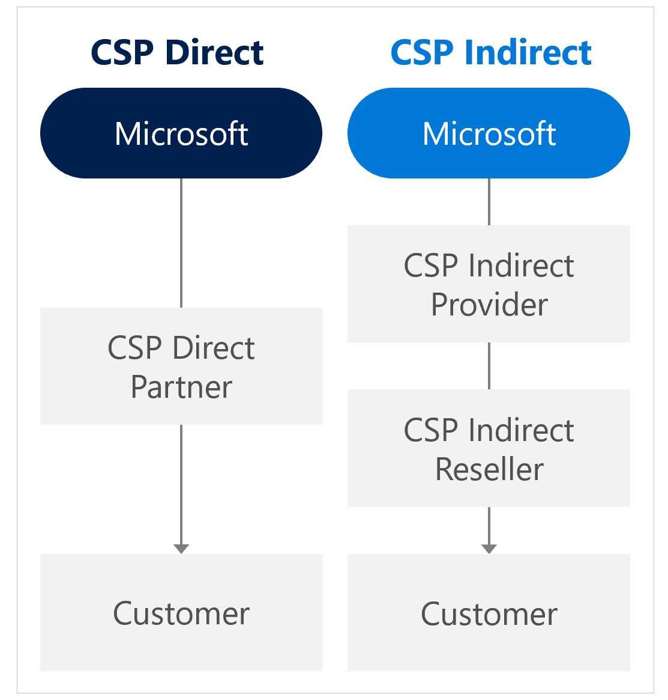

## Navigation Menu
* [Getting started](../src/platform-automation#platform-automation---getting-started)
* [Landing zones](./Landing-zones.md)
    -	[Artifacts](./Artifacts.md)
    -   [Customers](../src/platform-automation/cmdb#customers)
    -	[Multi tenant deployments](./Multi-tenant-deployments.md)
* [Platform automation at scale](./Platform-automation-at-scale.md)
* [Design Guidelines](./Design-Guidelines.md)
    -	**CSP and Azure AD Tenants**
    -	[Identity, Access Management and Lighthouse](./Identity-Access-Management-and-Lighthouse.md)
    -	[Management Group and Subscription Organisation](./Management-Group-and-Subscription-Organisation.md)
    -	[Management and Monitoring](./Management-and-Monitoring.md)
    -	[Security, Governance and Compliance](./Security-Governance-and-Compliance.md)
    -	[Platform Automation and DevOps](./Platform-Automation-and-DevOps.md)
---

# Buying Azure - Enrollments and Azure AD Tenants

There are multiple ways of purchasing Azure. As a customer you can buy Azure subscriptions through a direct agreement with Microsoft (MCA/Enterprise agrement), on a credit card or buy directly from partners. When purchasing from a partner - there are two different ways you should be aware of - which will have some implications in billing and support. 

Figure 1 – CSP Models

CSP Direct model (1-tier)
-   Partner works with Microsoft directly 
-   Fixed discount for Azure
-   Partner needs to provide billing tools and build support practice
-   Credit check during the onboarding process

CSP Indirect model (2-tier)
-   CSP Indirect Provider (aka Distributor) – transacts to Microsoft, provides billing tools and technical support.
-   CSP Indirect Reseller – sells Azure to customers through CSP Indirect Provider.

## 1. Planning for Enrollment 
A customer have multiple ways of purchasing Azure. If they chose to transact directly from Microsoft - this is often done through an MCA agremeents. Customers can buy Azure and managed services from multiple partners and CSP is a common way for partners to provide support and managed solutions into the customers environment.

A CSP (Cloud Solution Provider) contract represents the commercial relationship between Microsoft, the partner and the customer regarding their use of Azure. It provides the basis for billing across all customer subscriptions and therefore has an impact on administration of the customer estate. A partner will create a tenant with Microsoft or will create subscriptions on an existing tenant. Each subscription will be billed seperately to the partner who will then be able to bill the customer. For more information on CSP please go here: http://aka.ms/csp

***Design Considerations***

-   The tenant provides a hierarchical organizational structure to govern the management of customer subscriptions.

-   Different customer environments can be separated by using multiple subscriptions on a single tenant to support holistic isolation.

-   There can be multiple administrators appointed to a single tenant and or subscription

-   Each Subscription must have an associated Account owner.

-   Each tenant owner will be made a subscription owner for any subscriptions provisioned under that account. (???)

-   A Subscription can only belong to one tenant at any given time.

-   A Subscription can be suspended based on a specified set of criteria.

***Design Recommendations***

-   Setup the notification account email address to ensure notifications are sent to an appropriate group mailbox.

-   Assign a budget for each subscription and establish an alert associated with the budget.

-   Leverage the Department organisational element to map customer business divisions. (EA Only?)

-   Create a new Department if business domains have independent IT capabilities. (EA Only?)

-   Restrict and minimise the number of owners within the tenant to avoid the proliferation of admin access to subscriptions and associated Azure resources.

-   Separate Dev/Test/Prod environments at an subscription level to support holistic isolation.

<!-- -->

-   Do not ignore notification emails sent to the notification account email address. Microsoft sends important communications to this account.

-   Do not move or rename an owner account in Azure AD.

## 2. Define Azure AD Tenants

An Azure AD tenant is an instance of Azure Active Directory which contains accounts and groups, and acts as an authentication source for subscriptions, which must be rooted to a single AAD tenant.

***Design Considerations***

-   A single tenant can have multiple CSP Azure subscriptions.

***Design Recommendations***

-   Leverage AAD SSO based on the selected [planning topology](https://docs.microsoft.com/en-us/azure/active-directory/hybrid/plan-connect-topologies).

-   Enforce MFA and conditional access policies for all privileged accounts.

-   Plan for Emergency access or break-glass accounts to prevent tenant-wide account lockout.

-   Use AAD PIM for Identity and Access management.

-   If Dev/Test/Prod are going to be completely isolated environments from an identity perspective, separate them at a subscription level.

<!-- -->

-   Avoid creating a new AAD tenant unless there is a strong IAM justification and processes are already in-place.
