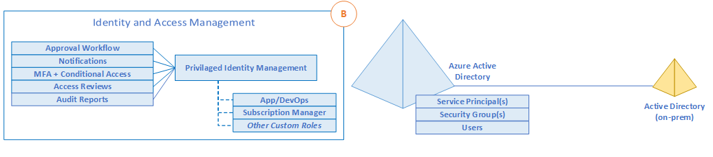

## Navigation Menu
* [Getting started](../src/platform-automation#platform-automation---getting-started)
* [Landing zones](./Landing-zones.md)
    -	[Artifacts](./Artifacts.md)
    - [Customers](../src/platform-automation/cmdb#customers)
    -	[Multi tenant deployments](./Multi-tenant-deployments.md)
* [Platform automation at scale](./Platform-automation-at-scale.md)
* [Design Guidelines](./Design-Guidelines.md)
    -	[CSP and Azure AD Tenants](./CSP-and-Azure-AD-Tenants.md)
    -	**Identity, Access Management and Lighthouse**
    -	[Management Group and Subscription Organisation](./Management-Group-and-Subscription-Organisation.md)
    -	[Management and Monitoring](./Management-and-Monitoring.md)
    -	[Security, Governance and Compliance](./Security-Governance-and-Compliance.md)
    -	[Platform Automation and DevOps](./Platform-Automation-and-DevOps.md)
---

# Identity, Access Management and Lighthouse

Figure 4 – Identity and Access Management

**Identity Baseline** is one of the Five Disciplines of Cloud Governance within the Cloud Adoption Framework governance model. Identity is increasingly considered the primary security perimeter in the cloud, which is a shift from the traditional focus on network security. Identity services provide the core mechanisms supporting access control and organization within IT environments, and the Identity Baseline discipline complements the Security Baseline discipline by consistently applying authentication and authorization requirements across cloud adoption efforts.

This section will examine design considerations and recommendations surrounding identity and access management for Microsoft partners.

## 1. Planning for Authentication Management

A key factor in for a cloud CSP in structuring the cloud-based identity services is the level of integration required with your existing on-premises identity infrastructure. Requirements for authentication inside the "Landing Zone" should therefore be thoroughly assessed and incorporated into plans to deploy AD, AAD-DS or both.

***Design Considerations***

-   Centralized and delegated responsibilities to manage resources deployed inside the "Landing Zone".
-   Capability and performance differences between AD, AAD, and AAD Domain Services.
-   There are some Azure services that rely on AAD-DS, such as HDInsight, Azure File Service, WVD.
-   Handling of privileged operations, such as creating a Service Principal within the AAD tenant, Registering Graph applications inside AAD, and procuring a wildcard certificate.
-   AAD Proxy frontend authentication for applications relying on Integrated Windows Authentication (IWA), Forms/Header based authentication as well as rich client apps integrated with ADAL.

***Design Recommendations***

- Cloud-based identity management is an iterative process. You should choose the model that is matching your cloud maturity level. One can always start small with a small set of users in a cloud native solution.

- Come up with relevant cloud policy statements to address specific risks identified in the risk assessment cycle. For each statement, identify the following information: **technical risk**, **policy statement**, and **design options**. Some example risks: weak authentication mechanisms, lack of shared management accounts between on premises and the cloud, isolated identity providers, etc. 

  Expanding one topic as example:

  ######       Weak authentication mechanisms

  ​      **-  Technical risk:** Identity management systems with insufficiently secure user authentication methods, such as basic user/password combinations, can lead to compromised or hacked passwords, providing a major risk of unauthorized access to secure cloud systems.

  ​      **- Policy statement:** All accounts are required to sign in to secured resources using a multi-factor authentication method.

  ​      **- Potential design options:** For Azure Active Directory, implement Azure MFA as part of your user authorization process.

- Evaluate the toolchain options and implement your toolchain by first rolling out in a pre-deployment phase, and then migrate.

- Develop a (draft) Architecture Guideline document. First review for that purpose the use of patterns discussed throughout the architectural decision guides.

- Customize the toolchain based on changes in your organization’s requirements and needs. Update the Architecture Guideline document accordingly.

- Evaluate the compatibility of workloads for AD and AAD-DS.

-   Deploy AAD-DS within the primary region as this service can be projected into only one subscription.

    -   Use Virtual Network Peering to support its usage as an authentication service.

- Use Managed Identities instead of Service Principles for authentication to Azure services.

-   Use Just-In-Time access for both VM access and Azure control plane administration.

-   Do not assume existing workloads are agnostic of AD and AAD-DS authentication, as there are differences between both approaches.
## 2. Planning for Access Management

CSPs will typically follow a least-privileged approach to operational access and this model should be expanded to consider Azure through AAD RBAC and custom role definitions. It is therefore critical to appropriately plan how to govern control plane and data plane access to resources in Azure, while also fully aligning with Joiner/Mover/Leaver (JML) processes.

***Design Considerations***

- There is a limit of 2000 custom RBAC role assignments per subscription.

- There is a limit of 500 custom RBAC role assignments per management group.

-   Centralized versus federated resource ownership.

    -   Shared resources such as the network will need managed centrally.

    -   The management of application resources can be delegated to application teams.
    
- Custom role definitions can be used to map responsibility boundaries between central and application teams.

- Azure AD resides in an Azure subscription. Global Admin can self-designate permission to manage Azure. Service & Account Admins are assigned on each subscription.

- Challenges of AOBO (admin on behalf of): 

  - No granularity between customers. Users in Admin Agents Group get Owner permissions in all Azure subscriptions of  all .customers
  - No granularity on Azure. Users in Admin Agents Group are owners and role cannot be changed.

- Challenges for MSPs in Azure include such as inconsistent identity management (B2B invites, CSP admin agents, foreign principle), no cross-tenant visibility as well as complexity in managing customers at scale. The recommended solution is to use Azure lighthouse (elaborated more in the recommendations).

  

***Design Recommendations***

-   Use AAD RBAC to manage data plane access to resources where possible (e.g. Key Vault, Storage Account, Azure SQL DB).
-   Use AAD PIM to establish zero standing access.
-   Use "AAD only" groups for Azure control plane resources in PIM when creating entitlements.

    -   Add on-premise groups to the "AAD only" group if there is an existing group management system already in place.
-   Integrate Azure AD logs with Azure Log Analytics.
-   To simplify permissions, evaluate and choose from the built in roles designed to cover most normal scenarios and avoid creating complicated custom roles. 
-   Avoid Granular and custom permissions specifically referencing resources or users. 
    -   Use *management group* and *resource group* rather than resource specific permissions.
    -   To *assign access to groups in Azure AD* rather than using user specific permissions.
-   Use Identity Score in Azure Active Directory to identify key recommendations and monitor progress.
-   Govern all the employees, vendors, and contractors that take on administrative rights need by leveraging the “Just-In-Time” and “Just-Enough” admin capabilities of AAD PIM.
-   Set up a process to manage access beyond what was initially provisioned for a user when that user’s identity was created. Consider automating the process through technologies such as dynamic groups and entitlements.
-   Set up recurring review pattern and regularly review privileges with a business-critical impact.
-   Use terms of use to get formal consent from users in form of accepting your terms of use (ToU)
-   Use Custom RBAC role definitions within the AAD tenant, considering the following key roles

| Role                             | Usage                                                        | Actions:                                                     | No Actions:                                                  |
| -------------------------------- | ------------------------------------------------------------ | ------------------------------------------------------------ | ------------------------------------------------------------ |
| Azure Platform Owner             | Management Group and Subscription lifecycle management       | *                                                            |                                                              |
| Network Management (NetOps)      | Platform wide Global Connectivity management; VNets, UDRs, NSGs, NVAs, VPN, ER etc. | \*/read, Microsoft.Authorization/\*/write, Microsoft.Network/vpnGateways/\*, Microsoft.Network/expressRouteCircuits/\*, Microsoft.Network/routeTables/write, Microsoft.Network/vpnsites/\* |                                                              |
| Security Operations (SecOps)     | Security Administrator role with a horizontal view across the entire Azure estate and the KV Purge Policy | \*/read, \*/register/action, Microsoft.KeyVault/locations/deletedVaults/purge/action,   Microsoft.Insights/alertRules/\*, Microsoft.Authorization/policyDefinitions/\*, Microsoft.Authorization/policyassignments/\*, Microsoft.Authorization/policysetdefinitions/\*, Microsoft.PolicyInsights/\*,Microsoft.Security/\* |                                                              |
| Subscription Owner               | Delegated Role for Subscription Owner derived from subscription Owner role | *                                                            | Microsoft.Authorization/\*/write, Microsoft.Network/vpnGateways/\*, Microsoft.Network/expressRouteCircuits/\*, Microsoft.Network/routeTables/write, Microsoft.Network/vpnsites/\* |
| Application Owners DevOps/AppOps | Contributor role granted for application/operations team at resource group level |                                                              | Microsoft.Network/publicIPAddresses/write, Microsoft.Network/virtualNetworks/write, Microsoft.KeyVault/locations/deletedVaults/purge/action |

-   Use JIT for all IaaS Resources to enable network level protection.

-   Use AAD Managed Service Identities (MSI) for Azure resources, avoiding username and password-based authentication.

-   Use privileged identities for automation runbooks that require elevated access permissions.

<!-- -->

- Do not add users directly to Azure resource scopes.

- Adopt **Azure Lighthouse** , which offers service providers a single control plane to view and manage Azure across all their customers with higher automation, scale, and enhanced governance:

  - it allows finer control on what permission each user/group gets
  - shall reduce the number of users with the Admin Agents role
  - Enable all advanced security features for those users (MFA, IP, PIM)

- Some best security practices:

  - Enable MFA on MSP tenant

  - Apply principle of least privilege

  - Use AAD PIM to control access to delegated groups (in private preview)

  - Additional segmentation can be achieved creating groups per customer or industry segment

    - Example:

      1. Tier 1 support group assigned to every customer as Reader

      2. Tier 2 and 3 support are assigned on a customer by customer basis

         --> This would mean creating one marketplace offer plan or template per industry or per customer
