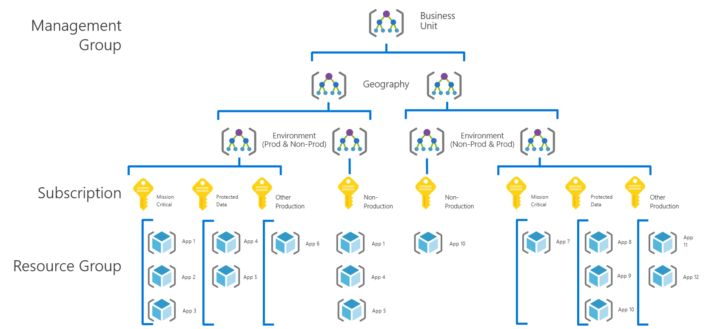
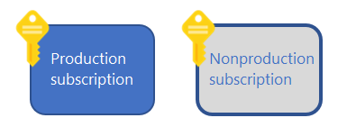

## Navigation Menu
* [Getting started](../src/platform-automation#platform-automation---getting-started)
* [Landing zones](./Landing-zones.md)
    -	[Artifacts](./Artifacts.md)
    -   [Customers](../src/platform-automation/cmdb#customers)
    -	[Multi tenant deployments](./Multi-tenant-deployments.md)
* [Platform automation at scale](./Platform-automation-at-scale.md)
* [Design Guidelines](./Design-Guidelines.md)
    -	[CSP and Azure AD Tenants](./CSP-and-Azure-AD-Tenants.md)
    -	[Identity, Access Management and Lighthouse](./Identity-Access-Management-and-Lighthouse.md)
    -	**Management Group and Subscription Organisation**
    -	[Management and Monitoring](./Management-and-Monitoring.md)
    -	[Security, Governance and Compliance](./Security-Governance-and-Compliance.md)
    -	[Platform Automation and DevOps](./Platform-Automation-and-DevOps.md)
---

# Management Group and Subscription Organisation

Figure 1 – Management Group Hierarchy

Within an AAD tenant, Management Group structures help to support organisational mapping and must therefore be appropriately considered when planning Azure adoption at-scale.

***Design Considerations***

-   Subscriptions serve as a scale unit so that component workloads can scale within platform [subscription limits](https://docs.microsoft.com/en-us/azure/azure-subscription-service-limits).

-   Management groups can be used to aggregate Policy and Initiative assignments.

-   There is a limit of 7 levels in any nested Management Group structure.

-   Management groups and subscriptions can only support one parent

-   Management groups can have many children

-   Same subscription can't be part of multiple MGs. You can move subscriptions between MGs.

-   Certain role will be needed to create MGs. Check [Management Group Access](https://docs.microsoft.com/en-us/azure/governance/management-groups/overview#management-group-access)
 

***Design Recommendations***

-   Treat subscriptions as a democratised unit of management aligned with business needs and priorities

-   Decide which resource types are available in a subscription by default.

-   Decide what all standard subscriptions should look like. Considerations include RBAC access, policies, tags, and infrastructure resources.

-   Define structures for naming and tagging

-   Segregate duties within your team and grant only the amount of access to users that they need to perform their jobs. Instead of giving everybody unrestricted permissions in your Azure subscription or resources, allow only certain actions at a particular scope. 

-   Prefered to programmatically create new subscriptions via a service principal. You must grant permission to the service principal to create subscriptions.

-   Use management groups to model your organization or mirror your billing hierarchy

-   Group Subscriptions in MG based on a need for common roles assigned along with Azure Policies and initiatives

-   Do not create Subscriptions under the "root" Management Group.

-   Do not transpose the organisational structure into a deeply nested management group hierarchy.

-   Limit the number of Azure Policy assignments made at the root Management Group scope to avoid managing through exclusions at inherited scopes.

***Example***

Figure 2 – Production and nonproduction subscriptions

-   Using separate subscriptions for your production and nonproduction environments creates a boundary that makes management of your resources simpler and safer.
-   Azure has specific Dev/Test subscription offerings for nonproduction workloads. These offerings provide discounted rates on Azure services and software licensing.
-   Your production and nonproduction environments will likely have different sets of Azure policies. -   Using separate subscriptions makes it simple to apply each distinct policy at the subscription level.
-   You can allow certain types of Azure resources in your nonproduction subscription for testing purposes. You can enable those resource providers in your nonproduction subscription without making them available in your production environment.
-   You can use dev/test subscriptions as isolated sandbox environments. These sandboxes allow administrators and developers to rapidly build up and tear down entire sets of Azure resources. This isolation can also help with data protection and security concerns.
-   The acceptable cost thresholds that you define will likely vary between production and dev/test subscriptions.

