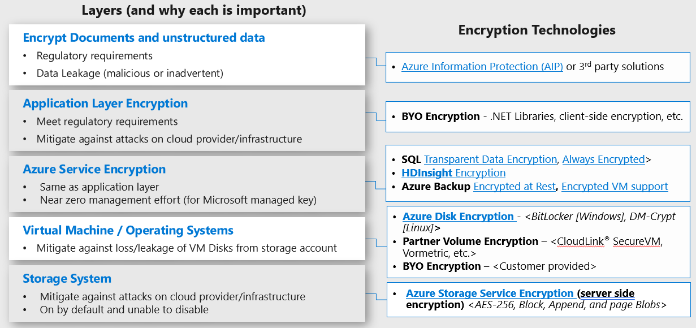

## Navigation Menu
* [Getting started](../src/platform-automation#platform-automation---getting-started)
* [Landing zones](./Landing-zones.md)
    -	[Artifacts](./Artifacts.md)
    -   [Customers](../src/platform-automation/cmdb#customers)
    -	[Multi tenant deployments](./Multi-tenant-deployments.md)
* [Platform automation at scale](./Platform-automation-at-scale.md)
* [Design Guidelines](./Design-Guidelines.md)
    -	[CSP and Azure AD Tenants](./CSP-and-Azure-AD-Tenants.md)
    -	[Identity, Access Management and Lighthouse](./Identity-Access-Management-and-Lighthouse.md)
    -	[Management Group and Subscription Organisation](./Management-Group-and-Subscription-Organisation.md)
    -	[Management and Monitoring](./Management-and-Monitoring.md)
    -	**Security, Governance and Compliance**
    -	[Platform Automation and DevOps](./Platform-Automation-and-DevOps.md)
---

# Security, Governance and Compliance

## 1. Data Protection

- Create policies that enforce the use of encryption at rest on VMs and App Services when available. 

- When possible, use Microsoft managed encryption keys. This saves time and resources on key management activities.

- If customer requires to manage its own keys, use Azure KeyVault when possible. Use one KeyVault per security boundary.

- See more details about encryption design choices [here](https://docs.microsoft.com/en-us/azure/cloud-adoption-framework/decision-guides/encryption/) and [here](https://docs.microsoft.com/en-us/azure/security/fundamentals/data-encryption-best-practices). 

- See Azure Encryption options in the image below

## 2. Security Management

- Enable Azure Security Center (ASC) for all customer subscriptions. 

- Create your own customized policies for Azure Security Center that match your own recommendations. You might have several custom policies to adjust to different customer segments (ie. financial vs public sector) or to different managed services you offer (ie. full security posture management service vs managed detection and response).

- Keep every custom policy that you create as code in your repository, to enhance traceability and automation.

- Monitor Secure Score and act upon recommendations. Create your own workflows to automate the response to recommendations (ie. enable Just In Time access for VMs). More details [here](https://docs.microsoft.com/en-us/azure/security-center/workflow-automation).

- Stream ASC recommendations to your log analytics workspace so you can build dashboards and workbooks based on this data. More details [here](https://docs.microsoft.com/en-us/azure/security-center/continuous-export).

## 3. Threat Protection

- When possible enable ASC Standard Tier to add Threat protection capabilities for VMs and PaaS services. Remember that Standard Tier includes Microsoft Defender ATP for Windows Servers.

- Create your own automated response to attacks coming from ASC. More details [here](https://docs.microsoft.com/en-us/azure/security-center/workflow-automation).

- If using Azure Sentinel, connect ASC to it to receive all relevant alerts. If using a different SIEM, configure Continuous Export to send relevant data to Event Hub and then to external SIEM. More details [here](https://docs.microsoft.com/en-us/azure/security-center/continuous-export).

- If using Azure Sentinel as your customer's SIEM, watch [this webinar](https://youtu.be/hwahlwgJPnE) focused on MSSP best practices with all the considerations to take into account.

