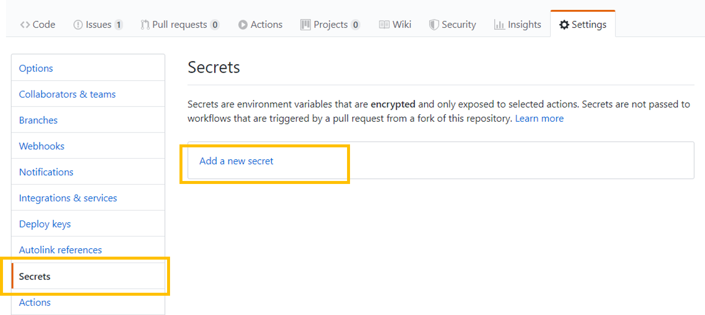

## Navigation Menu
* **Getting started**
* [Landing zones](../../docs/Landing-zones.md)
    -	[Artifacts](../../docs/Artifacts.md)
    -   [Customers](./cmdb#customers)
    -	[Multi tenant deployments](../../docs/Multi-tenant-deployments.md)
* [Platform automation at scale](../../docs/Platform-automation-at-scale.md)
* [Design Guidelines](../../docs/Design-Guidelines.md)
    -	[CSP and Azure AD Tenants](../../docs/CSP-and-Azure-AD-Tenants.md)
    -	[Identity, Access Management and Lighthouse](../../docs/Identity-Access-Management-and-Lighthouse.md)
    -	[Management Group and Subscription Organisation](../../docs/Management-Group-and-Subscription-Organisation.md)
    -	[Management and Monitoring](../../docs/Management-and-Monitoring.md)
    -	[Security, Governance and Compliance](../../docs/Security-Governance-and-Compliance.md)
    -	[Platform Automation and DevOps](../../docs/Platform-Automation-and-DevOps.md)
---

# Platform automation - getting started
This section is used to setup the exact environment. Once you fork this repository from GitHub or use this template, the following are required: 
 - An Azure Storage account (for storing artifacts)
 - An SPN for your Azure Lighthouse automation (e.g. scanning for subscriptions, deploying at scale etc)
 - An SPN for with User Access administrator access (or global admin) for customer platform provisioning and automation
 - Update variables

## Create storage account used for artifacts
All the artifacts defined in the artifacts repo will be published in a storage account. All the customer deployments will use that storage account to access the templates/definitions that need to be deployed. 

     cd .\src\platform-automation
     Add-Azaccount
     $rg = new-AzResourceGroup -resourcegroupname 'rg-prod-automation' -location 'west europe'
     $deploy = new-azresourcegroupdeployment -resourcegroup $rg.ResourceGroupName -templateFile .\artifacts\templates\resourcegroup\Storage-Account.json -storageAccountNamePrefix 'devops' -verbose
     # Output names & key     
     $deploy.outputs.storageAccountName.value     
     $deploy.outputs.masterKey.value

***Copy these value for storageAccount and masterKey*** as these will be stored as ***secrets*** in Github and used by the pipelines to publish the artifacts & do the deployments. 

## Update variables (Github)
 - Update the workflows 
    - Replace the value for storageAccountName and paste your value
 - Add a github secret 
    - Secretname: AZURE_DEPLOYMENT_STORAGE_SAS with masterKey value

## Create SPN and add as secret to Github (actions)

### Create SPN (User Access Administrator)
Instructions for how to create an SPN for deployments in customer tenant.

From Azure CLI:

    az ad sp create-for-rbac --name "DevOpsGlobalAdmin" --role 'Owner' --sdk-auth

    As a recommendation, include the SPN in the Lighthouse offer for your customers. In this way, the SPN will have access to all the delegated resources and can be used to do the deployments across multiple customers at once, with one identity access. 

    You might want to give this SPN User Access Administrator as well to elevate privileges for certain deployments. You can achieve this by elevating the User Access Administrator and Owner to root level: 

    New-AzRoleAssignment -ApplicationId '<appId>' -RoleDefinitionName 'User Access Administrator' -Scope /
    New-AzRoleAssignment -ApplicationId '<appID' -RoleDefinitionName 'Owner' -Scope /
    
    Your output will be something like this - copy and paste the entire string 

    {
        "clientId": "<<Retracted>>,
        "clientSecret": "<<Retracted>>",
        "subscriptionId": "<<Retracted>>",
        "tenantId": "<<Retracted>>",
        "activeDirectoryEndpointUrl": "https://login.microsoftonline.com",
        "resourceManagerEndpointUrl": "https://management.azure.com/",
        "activeDirectoryGraphResourceId": "https://graph.windows.net/",
        "sqlManagementEndpointUrl": "https://management.core.windows.net:8443/",
        "galleryEndpointUrl": "https://gallery.azure.com/",
        "managementEndpointUrl": "https://management.core.windows.net/"
    }

Copy the entire json string as this will be stored as a secret in Github.                   

### Create Github secrets 

1. On GitHub, navigate to the main page of the repository. 
2. Under your repository name, click on the "Settings" tab. 
3. In the left sidebar, click Secrets. 
4. On the right bar, click on "Add a new secret"  

5. Add the secret name: AZURE_STORAGE_ACCOUNT with the masterKey value copied when the storage account was created 
6. Add the secret name: AZURE_DEPLOYMENT_STORAGE_SAS with the storageAccountName value copied when the storage account was created 
7. Add the secret name: AZURE_SUBSCRIPTION_CREDENTIAL with the json string value copied when the SPN was created

*** Note *** When managing multiple customers - replace _SUBSCRIPTION_ with Customername instead. E.g AZURE_CONTOSO_CREDENTIAL - and make sure to refer the right credential in the customer pipeline.

[Read more about Github secrets](https://github.com/Azure/actions-workflow-samples/blob/master/assets/create-secrets-for-GitHub-workflows.md)

### Create SPN for Lighthouse management & automation
Create the Lighthouse SPN that you will use for automation for managing customers through Lighthouse. Make sure that the SPN is added in the Lighthouse offer for your customers and has the premissions needed. Check this for more info on Lighthouse scenarios and permissions needed.

Call the secret AZURE_LIGHTHOUSE_CREDENTIAL in Github actions and paste the value.

## Resources
#### Creating workflows / Pipelines
[GitHub actions - Docs](https://help.github.com/en/actions/configuring-and-managing-workflows/configuring-a-workflow)

### ARM deployments
- [Management group deployment](https://docs.microsoft.com/en-us/azure/azure-resource-manager/templates/deploy-to-tenant#create-management-group)

### Image packing
https://docs.microsoft.com/en-us/azure/virtual-machine-scale-sets/virtual-machine-scale-sets-automatic-upgrade#automatic-os-image-upgrade-for-custom-images-preview
Packer

