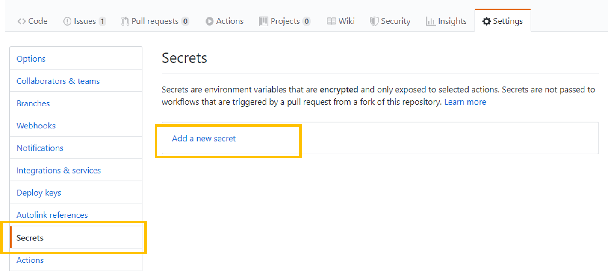

# Getting started
This will require you to have understanding of git, installing software and how ARM template works. If you are new to the subject - please read up on the material before starting.

For the setup - we will be using Github - but scripts used in workflows will work for Azure DevOps as well and steps can easily be modified for Azure DevOps. 

## 1. Prepare local dev machine & accounts
The following should be installed on your workstation:

 - VSCode
 - Git cli
 - PowerShell Core
 - Az Module
 - Az CLI
 - Access to Azure subscription as a global admin

## 2. Prepare repository & Azure

- Create a github account if you don't have one already
- Fork this repository
- Create a wiki for the newly forked project
- Clone the two repositories on your local machine

## 3. Create storage account used for artifacts
All the artifacts defined in the artifacts repo will be published in a storage account. All the customer deployments will use that storage account to access the templates/definitions that need to be deployed. 
     
     cd .\src\platform-automation
     Add-Azaccount
     "dev","prod"|Foreach-Object {
        $rg = new-AzResourceGroup -resourcegroupname "rg-$($_)-automation"-location 'west europe'
        $deploy = new-azresourcegroupdeployment -resourcegroup $rg.ResourceGroupName -templateFile .\artifacts\templates\resourcegroup\Storage-Account.json -storageAccountNamePrefix 'devops' -verbose
        # Output names & key     
        Write-Output "$($_) storage account name: "
        $deploy.outputs.storageAccountName.value 
        Write-Output "$($_) storage masterKey: "    
        $deploy.outputs.masterKey.value
     }

***Copy these value for storageAccount and masterKey*** as these will be stored as ***secrets*** in Github and used by the pipelines to publish the artifacts & do the deployments. 

## Create secrets and update variables (Github)
1. Create secrets
- On GitHub, navigate to the main page of the repository. 
- Under your repository name, click on the "Settings" tab. 
- In the left sidebar, click Secrets. 
- On the right bar, click on "Add a new secret"  

[](#)

- Add two github secrets: AZURE_DEPLOYMENT_STORAGE_SAS_DEV and AZURE_DEPLOYMENT_STORAGE_SAS_PROD with the respective masterKey values

2. Update the workflows 

Replace the value for storageAccountName and paste your value for the following workflows:

    - Deploy-All-Customers
    - Deploy-Contoso
    - Deploy-Fabrikam

- Add two github secrets 
    - Secretname: AZURE_DEPLOYMENT_STORAGE_SAS_DEV and AZURE_DEPLOYMENT_STORAGE_SAS_PROD with the respective masterKey values

## Create SPN and add as secret to Github (actions)

### Create SPN (User Access Administrator)
Instructions for how to create an SPN for deployments in customer tenant.

From Azure CLI:

    az ad sp create-for-rbac --name "DevOpsGlobalAdmin" --role 'Owner' --sdk-auth

    As a recommendation, include the SPN in the Lighthouse offer for your customers. In this way, the SPN will have access to all the delegated resources and can be used to do the deployments across multiple customers at once, with one identity access. 

    You might want to give this SPN User Access Administrator as well to elevate privileges for certain deployments
    You can achieve this by elevating the User Access Administrator and Owner to root level. 

    New-AzRoleAssignment -ApplicationId '<appId>' -RoleDefinitionName 'User Access Administrator' -Scope /
    New-AzRoleAssignment -ApplicationId '<appID' -RoleDefinitionName 'Owner' -Scope /
    
    Your output will be something like this - copy and paste the entire string 

    {
        "clientId": "<<Retracted>>,
        "clientSecret": "<<Retracted>>",
        "subscriptionId": "<<Retracted>>",
        "tenantId": "<<Retracted>>",
        "activeDirectoryEndpointUrl": "https://login.microsoftonline.com",
        "resourceManagerEndpointUrl": "https://management.azure.com/",
        "activeDirectoryGraphResourceId": "https://graph.windows.net/",
        "sqlManagementEndpointUrl": "https://management.core.windows.net:8443/",
        "galleryEndpointUrl": "https://gallery.azure.com/",
        "managementEndpointUrl": "https://management.core.windows.net/"
    }
Copy the entire json string as this will be stored as a secret in Github.                 

### Create secret for customer deployment
Create a secret called AZURE_SUBSCRIPTION_CREDENTIAL and paste the value from previous step.
*** Note *** When managing multiple customers - replace _SUBSCRIPTION_ with Customername instead. E.g AZURE_CONTOSO_CREDENTIAL - and make sure to refer the right credential in the customer pipeline.

[Github secrets](https://github.com/Azure/actions-workflow-samples/blob/master/assets/create-secrets-for-GitHub-workflows.md)

### Create SPN for Lighthouse management & automation
Repeat the 2 last steps - but create the Lighthouse SPN that you will use for automation for managing customers through Lighthouse. Call the secret AZURE_LIGHTHOUSE_CREDENTIAL in Github actions and paste the value.

## Build your first repeatable building block 

For this exercise - we will focus on secure development practices and building repeatable concepts that you can later deploy. 
At this point you will not be creating a fully fledged Landing Zone, but adding an artifact (in this example: a WebApp), validating and testing it, before adding it to a storage account. It will be used and deployed later to customers.   

 - Create a seperate branch called 'feature/lz-1'
 - Create your first template under artifacts\templates\resourcegroup\LogicApp.json
 - Make sure this is an empty ARM template
 - Validate that the template is valid (Test-AzResourceGroupDeployment)
 - Validate that the template follows the company best practices. Templates.tests.ps1 checks that all files in artifacts/templates are a valid JSON file and content

```
# Powershell
cd src\platform-automation
.\tests\Templates.tests.ps1   
```
 - Fix potential errors before commiting the file
 - Commit and push your change
 - Verify that the Workflow Test-And-Upload-Dev-Artifacts are running succesfully.
 - From the Azure portal - check that you have a new json file in your storage account targeted for 'dev'
 - Do a pull request onto master 
 - Verify that the Arm-TTK tests are running successfully
 - Merge the changes onto the master branch
 - Verify that the Publish-Artifacts-ToAzureStorage have run succesfully
 - Verify that you now have the template available in your production account ready for use.

Congrats! You now have a succesful pipeline to validate, approve and publish components for re-use!

## Create manifest and provision customer
We will now create a manifest that will be used to bootstrap a tenant (or customer). For the simplicity of this - we focus on the previous building block you created - but remember that deployments can happen on any scope (tenant, management group, subscription or resource group). 

 - Create a new feature branch called 'feature\customer_contoso'
 - Create a new folder under 'cmdb\customers' called 'contoso' 
 - Create an empty manifest.json under cmdb\customers\contoso (see reference)
 - Validate that this manifest is legal

```
# Powershell
cd src\platform-automation
.\tests\Artifacts.tests.ps1   
```
 - Update the settings in the manifest defaultDeploymentScope
 - Test the deployment 

 ```
 cd src\platform-automation
 # Run all deployments with -WhatIf
.\platform-scripts\Deploy-Customer.ps1 -customer 'contoso' -Verbose -DryRun
# Run the manifest with the current session - this will create and update Azure Resources
.\platform-scripts\Deploy-Customer.ps1 -customer 'contoso' -Verbose 
 ```
 - Commit and push the change to your feature branch
 - Verify that the workflow "Update wiki" is running successfully and building the wiki pages for your managed customers. You should be seeing something similar to this:

 [](#)

 - Click on the customers and you should be seeing Contoso listed as one of your customers managed as code:
 [](#)

 - Do a pull request onto master and merge this request. Verify that the workflow "Deploy-Contoso" runs. This workflow will run anytime anyone have approved changes to be rolled out for Contoso.

## Expanding the Manifest

You will now expand the Manifest - to include more useful features. To help you along the way - we have included a few, simple artifacts for you to build a management structure, do some operations and deploy some services and show how you can manage & deliver at scale. Remember - any ARM template can be an artifact and used in composing value. 

***NB: When running this on a management group or tenant deployment - you will need elevated privileges that you so far cannot have through Azure Lighthouse.***

- Create a management group structure as shown by adding the artifacts in the manifest: 
[](#)
- Create a new branch 'feature/customer_contoso_change_1'
- Move your subscription in under the 'platform' management group
- Add the Lighthouse offer 'lighthouseManagedSubscription' and make sure you have updated the parameters to your management tenant. 
- Test and deploy the updated manifest locally.
- Verify that the subscription is now added to your management tenant. 
- You can use the Build-DelegationList to list events on what customers have onboarded you, or you can verify this through the Azure Portal. 
- Push your changes, do a pull request and merge the changes on master
- Verify that the Deploy-Contoso workflow is running successully


## Self-documenting Governance 
A part have been added to automatically build and update each customer that is managed by code. If workflow have run - it should show you an overview of what have been provisioned and the current scanned governance structure for a customer as shown below:

- Verify that the Contoso Governance workflow has run (** this workflow builds the details page for Contoso). There's a known limitation in the Mermaid toolkit that is known to hang - so be aware if the workflow executes for more than 10 minutes - you should kill it. 

[](#)

## Subscription democratization
Subscriptions can be automated and democratized in the same manner by triggering on git events. 

To show a 'demo' on how this can be triggered :
- Create a new file in 'cmdb\customers\contoso' called new_subscription - with content "Contoso Subscription1"
- Commit and push this new file
- Verify that the workflow have run successfully, it have triggered the script with the correct parameters and the output is a subscription

***Note: This is just for demo - a partner/customer would implement and use PartnerCenter SDK in the Script demo, use the ARM deployment for new subscriptions or use the REST Apis to create subscriptions - depending on what lisencing model to use***

## Resources
#### Creating workflows / Pipelines
[GitHub actions - Docs](https://help.github.com/en/actions/configuring-and-managing-workflows/configuring-a-workflow)

### ARM deployments
- [Management group deployment](https://docs.microsoft.com/en-us/azure/azure-resource-manager/templates/deploy-to-tenant#create-management-group)

### Image packing
https://docs.microsoft.com/en-us/azure/virtual-machine-scale-sets/virtual-machine-scale-sets-automatic-upgrade#automatic-os-image-upgrade-for-custom-images-preview
Packer

